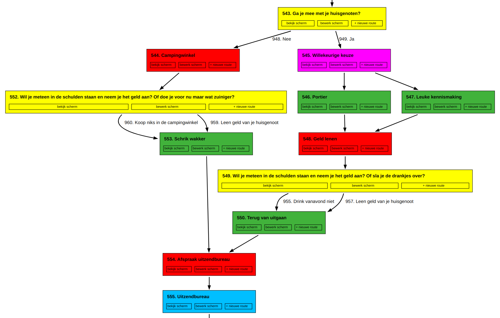

# Camping Kafka

This repository contains the website and game engine of the online
adventure game [Camping Kafka](https://kafka.created.today/). The game
draws attention to the often hopeless position of those at the bottom
of society who are forced to live in the proverbial Camping Kafka.

The `kafka` module contains the website and the `game` module contains
the game engine as well as a visual graph editor based on
[Graphviz](https://www.graphviz.org/):

## Installation

Install Python and run the following commands:

     pip install -r requirements.txt
     ./manage.py migrate
     ./manage.py createsuperuser
     ./manage.py runserver

## Usage

Point your webbrowser to http://localhost:8000/admin/ to add game
content. The visual graph editor can be found at
http://localhost:8000/game/graph/
